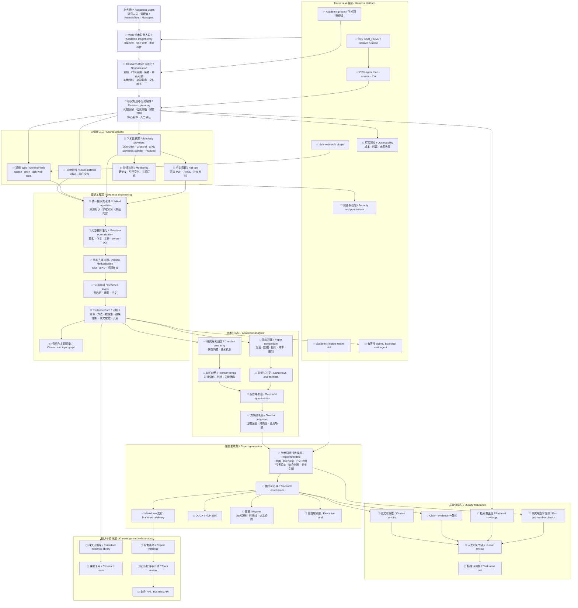

# Academic insight architecture and delivery plan

English | [中文](academic-insight-plan.zh.md)

## Summary

This page stores the non-authoritative working architecture and delivery plan for the Academic insight business. The team can use it to split work, agree on acceptance signals, and report milestone progress; [Academic insight preset](academic-insight.md) remains the source for current product behavior.

## Table of Contents

- [Working plan](#working-plan)

-----

### Dev Note: Working plan

This section is planning material, not a product promise. Update its statuses, milestones, risks, and assignments when the team changes the delivery decision.

#### Architecture map

Status legend: ✅ available in the MVP; 🔵 recommended next-stage capability; ◻ later capability.

#### Current reading

- The MVP gives users a selectable Academic insight preset, isolated runtime data, local and general-Web evidence access, evidence-level labeling, version deduplication guidance, direction-level analysis, and a traceable Markdown report structure.
- The main delivery gap is a normalized Research Brief and a durable evidence pipeline. Without them, retrieval quality and report consistency depend too much on the wording of each request.
- Scholarly providers and full-text parsing increase evidence quality only after metadata, deduplication, source locations, and evidence records have stable representations.
- Bounded multi-agent execution remains a later optimization because parallel workers need the durable evidence model before their findings can merge safely.

#### Delivery milestones

| Milestone | Outcome | Included work | Acceptance signal | Dependency |
|---|---|---|---|---|
| M0 — Runnable MVP | A user can select Academic insight and receive a structured, source-linked report. | Preset, localized picker, report skill, local files, general Web tools, isolated `DSH_HOME`. | Focused preset, UI, launcher, and documentation checks pass. | None. |
| M1 — Stable research input | Short and detailed requests resolve to the same explicit research specification when their intent is equivalent. | Research Brief fields, defaults, validation, one material clarification, visible confirmation. | A recorded scenario shows normalized scope, time range, audience, focus, source requirements, and output format. | M0. |
| M2 — Evidence pipeline | Each material conclusion can point to a normalized, deduplicated evidence record and an inspected source location. | Scholarly providers, metadata model, PDF/HTML extraction, Evidence Card, source provenance. | DOI and preprint versions merge correctly; metadata-, abstract-, and full-text-only claims remain distinguishable. | M1. |
| M3 — Decision-ready report | Researchers and managers receive consistent analysis with explicit confidence and review results. | Paper comparison, trend/conflict/gap analysis, citation and claim checks, figures, executive brief, DOCX/PDF output. | A benchmark topic passes source validity, claim–evidence, coverage, numerical review, and human approval criteria. | M2. |
| M4 — Reusable research platform | Teams can retain, refresh, review, and integrate research assets across topics. | Evidence library, scheduled monitoring, report versions, team review, business API, bounded multi-agent work. | A repeated topic reuses prior evidence, identifies new material, preserves review history, and exposes approved output. | M3. |

The recommended implementation order is M1 → M2 → M3. M4 begins only when repeated business demand justifies durable shared storage and operational ownership.

#### Team workstreams

| Workstream | Primary responsibility | Main handoff |
|---|---|---|
| Product and research method | Define Research Brief fields, report questions, evidence expectations, and approval criteria. | Versioned research specification and benchmark topics. |
| Retrieval and providers | Implement scholarly-source connectors, access policy, retries, and source provenance. | Normalized source documents with stable identifiers. |
| Evidence and analysis | Own deduplication, Evidence Cards, comparison, trend, conflict, gap, and confidence rules. | Auditable claims linked to inspected evidence. |
| Web and report experience | Present research input, progress, evidence, report navigation, export, and review states. | User-visible workflow and delivery artifacts. |
| Quality and evaluation | Maintain benchmark topics, invalid-source cases, citation checks, coverage measures, and human review rubrics. | Release evidence and regression signals. |
| Platform and operations | Own runtime isolation, permissions, observability, cost controls, persistence, and later bounded concurrency. | Operable deployments with accountable resource use. |

#### Progress reporting

Each team update records four items: milestone status, completed acceptance signals, the next acceptance signal, and a risk or decision that requires ownership. Leadership reporting uses the same structure and summarizes capability value instead of file-level activity.

Use the architecture map as the scope boundary. A proposed capability enters a milestone only when its owner, dependency, acceptance signal, and required evidence are explicit.
