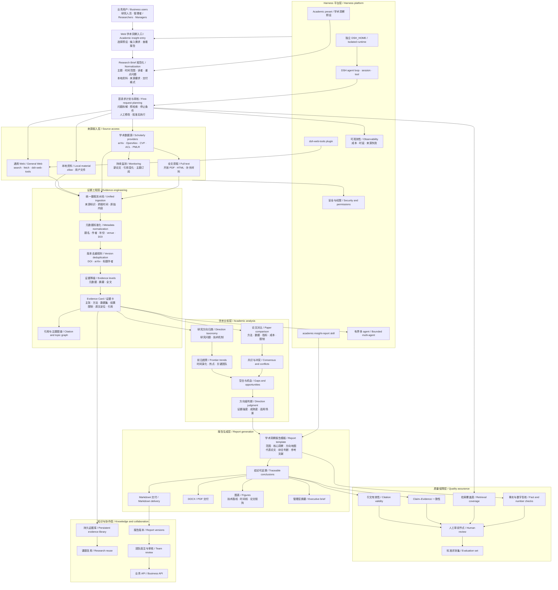

# Academic insight architecture and delivery plan

English | [中文](academic-insight-plan.zh.md)

## Summary

This page stores the non-authoritative working architecture and delivery plan for the Academic insight business. The team can use it to split work, agree on acceptance signals, and report milestone progress; [Academic insight preset](academic-insight.md) remains the source for current product behavior.

## Table of Contents

- [Working plan](#working-plan)

-----

### Dev Note: Working plan

This section is planning material, not a product promise. Update its statuses, milestones, risks, and assignments when the team changes the delivery decision.

#### Architecture map

The architecture map shows target scope, not acceptance status; the milestone table owns progress reporting.

#### Current reading

- As of 2026-09-21, based on local code and recorded acceptance: M0 is available, the new M1 entry awaits acceptance, M2 completion overlaps with M3 development, and M4 has not started as a whole. Implementation, automated checks, real runs, and final delivery are separate signals.
- Chinese plan review and retrieval from approved plans are implemented locally, related tests pass, and Web has restarted. The new flow still awaits real end-to-end acceptance; changes are uncommitted and unpushed. See the [plan retrieval record](../z-team_docs/开发记录/2026-09-21-zhouzhixian2021-计划到检索接入.md).
- Real RAG acceptance retained 4 papers and 20 valid evidence records and produced a limited draft with 23 analysis paragraphs. Paper count and length fell below Plan requirements, semantic review remains incomplete, and final delivery stays blocked. See the [synthesis and acceptance record](../z-team_docs/开发记录/2026-09-20-zhouzhixian2021-Academic逐题洞察分析.md).
- A temporarily performs development and acceptance for B and C, who are paused. Original module ownership remains; see [module responsibilities](../z-team_docs/模块分工/academic-module-ownership.md). Durable recovery and bounded multi-agent execution remain incomplete.

#### Delivery milestones

| Milestone | Intended outcome and scope | Current progress | Next acceptance signal and gaps | Dependency |
|---|---|---|---|---|
| M0 — Runnable MVP | Academic preset, Web entry, isolated runtime data, general material access, and source-linked Markdown reports. | Available; real Web runs can display and download research drafts. | Retain launch and report-viewing regression checks; this does not establish research sufficiency. | None. |
| M1 — Stable research input | Ordinary requests become explicit Research Briefs, reviewed before execution; equivalent intent yields consistent specifications. | Chinese plans, folded execution data, and approved search plans are implemented; new-entry automated checks pass, real acceptance remains pending. | Generate, review, and execute a broad Chinese request; verify retrieval matches approval and test intent consistency across short and detailed requests. | M0. |
| M2 — Evidence pipeline | Scholarly sources, metadata and version deduplication, HTML/PDF parsing, evidence cards, provenance, and source locations. | The main path has run with real sources; partial evidence retention and replenishment from existing candidates are implemented. | Improve relevance, version/scope exclusions, excerpt locations, and truncation; complete evidence recovery, long-paper chunking, and adaptive additional retrieval remain unfinished. | M1. |
| M3 — Decision-ready report | Cross-paper comparison, trend/conflict/gap analysis, citation and claim checks, figures, executive brief, and DOCX/PDF. | Question-based synthesis and limited Markdown drafts with disclosed gaps have real acceptance evidence; the milestone is incomplete. | A benchmark still needs coverage, numerical and semantic checks, and human review; figures and DOCX/PDF delivery remain unfinished. | M2. |
| M4 — Reusable research platform | Evidence library, monitoring, report versions, team review, business API, and bounded multi-agent work. | Not started as a whole; the existing Remote research entry is not a reusable research-asset platform. | Recoverable and reusable evidence/reports, new-material identification, review history, and approved-result delivery. | M3. |

Current order: accept the M1 plan-retrieval entry, improve M2 paper selection and evidence quality, then design gap-driven additional retrieval within approved budgets and advance M3 semantic review. Schedule performance work from measured stage latency; durable recovery needs a separate format and recovery decision. M4 begins only when repeated business demand justifies durable shared storage and operational ownership.

#### Team workstreams

| Workstream | Primary responsibility | Main handoff |
|---|---|---|
| Product and research method | Define Research Brief fields, report questions, evidence expectations, and approval criteria. | Versioned research specification and benchmark topics. |
| Retrieval and providers | Implement scholarly-source connectors, access policy, retries, and source provenance. | Normalized source documents with stable identifiers. |
| Evidence and analysis | Own deduplication, Evidence Cards, comparison, trend, conflict, gap, and confidence rules. | Auditable claims linked to inspected evidence. |
| Web and report experience | Present research input, progress, evidence, report navigation, export, and review states. | User-visible workflow and delivery artifacts. |
| Quality and evaluation | Maintain benchmark topics, invalid-source cases, citation checks, coverage measures, and human review rubrics. | Release evidence and regression signals. |
| Platform and operations | Own runtime isolation, permissions, observability, cost controls, persistence, and later bounded concurrency. | Operable deployments with accountable resource use. |

#### Progress reporting

Each team update records four items: milestone status, completed acceptance signals, the next acceptance signal, and a risk or decision that requires ownership. Leadership reporting uses the same structure and summarizes capability value instead of file-level activity.

Use the architecture map as the scope boundary. A proposed capability enters a milestone only when its owner, dependency, acceptance signal, and required evidence are explicit.
