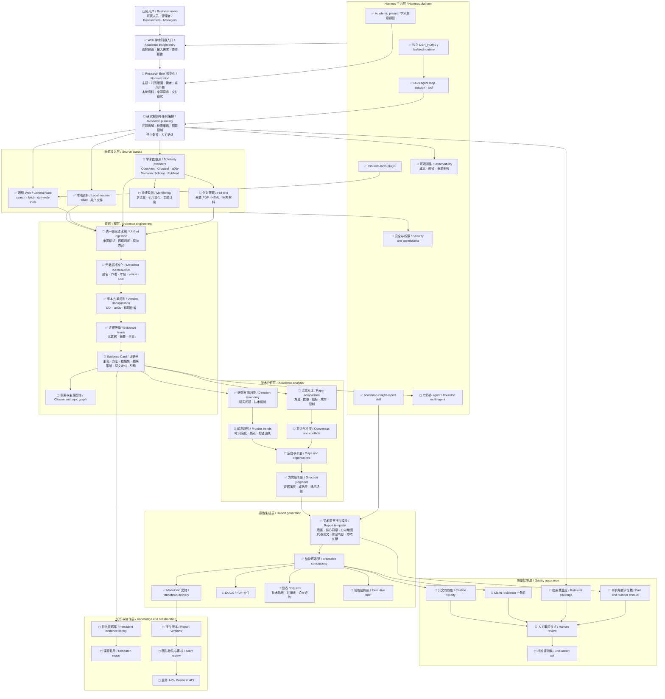

# 学术洞察架构与交付计划

[English](academic-insight-plan.md) | 中文

## 摘要

本页保存学术洞察业务的非权威工作架构与交付计划。团队可以用它拆分工作、约定验收信号并汇报里程碑进展；当前产品行为仍以[学术洞察预设](academic-insight.zh.md)为准。

## 目录

- [工作计划](#working-plan)

-----

### 开发备注：工作计划

本节属于计划材料，不构成产品承诺。团队改变交付决策时，需同步更新状态、里程碑、风险和任务分配。

#### 架构图

状态图例：✅ MVP 已具备；🔵 建议下一阶段建设；◻ 后续能力。

#### 当前判断

- MVP 已提供可选择的学术洞察预设、隔离运行数据、本地和通用 Web 证据访问、证据等级标注、版本去重指导、方向级分析以及可追溯的 Markdown 报告结构。
- 当前主要交付缺口是规范化 Research Brief 和持久证据流水线。缺少这两项时，检索质量和报告一致性仍会过度依赖每次请求的措辞。
- 只有元数据、去重、原文定位和证据记录形成稳定表示后，学术数据源与全文解析才能可靠提升证据质量。
- 有界多 agent 执行属于后续优化，因为并行 Worker 需要先依赖持久证据模型，才能安全合并研究结果。

#### 交付里程碑

| 里程碑 | 结果 | 工作范围 | 验收信号 | 依赖 |
|---|---|---|---|---|
| M0 — 可运行 MVP | 用户可以选择学术洞察并获得结构化、带来源链接的报告。 | 预设、本地化选择器、报告 skill、本地文件、通用 Web 工具、隔离 `DSH_HOME`。 | 聚焦的预设、UI、启动入口和文档检查通过。 | 无。 |
| M1 — 稳定研究输入 | 意图等价时，简短请求和详细请求解析为同一份明确研究规格。 | Research Brief 字段、默认值、校验、一次实质性澄清和可见确认。 | 一个录制场景展示规范化的范围、时间、读者、重点、来源要求和输出格式。 | M0。 |
| M2 — 证据流水线 | 每项实质性结论都能指向规范化、已去重的证据记录和已检查的原文位置。 | 学术数据源、元数据模型、PDF/HTML 提取、Evidence Card 和来源记录。 | DOI 与预印本版本正确合并；仅元数据、仅摘要和全文主张仍可区分。 | M1。 |
| M3 — 可供决策的报告 | 研究人员和管理者获得分析一致、置信度和审阅结果明确的报告。 | 论文对比、趋势/冲突/空白分析、引文与主张检查、图表、管理层摘要、DOCX/PDF 输出。 | 一个基准主题通过来源有效性、Claim–Evidence、覆盖度、数字复核和人工审批标准。 | M2。 |
| M4 — 可复用研究平台 | 团队可以跨课题保留、刷新、审核和集成研究资产。 | 证据库、定时监测、报告版本、团队审核、业务 API 和有界多 agent 工作。 | 重复课题复用已有证据、识别新增资料、保留审核历史并对外提供已批准结果。 | M3。 |

建议实施顺序为 M1 → M2 → M3。只有重复业务需求足以支撑共享持久存储和运维责任时，才启动 M4。

#### 团队工作流

| 工作流 | 主要责任 | 主要交付 |
|---|---|---|
| 产品与研究方法 | 定义 Research Brief 字段、报告问题、证据要求和审批标准。 | 版本化研究规格与基准主题。 |
| 检索与提供方 | 实现学术来源连接器、访问策略、重试和来源记录。 | 带稳定标识符的规范化来源文档。 |
| 证据与分析 | 负责去重、Evidence Card、对比、趋势、冲突、空白和置信度规则。 | 与已检查证据关联的可审计主张。 |
| Web 与报告体验 | 展示研究输入、进度、证据、报告导航、导出和审核状态。 | 用户可见工作流与交付产物。 |
| 质量与评测 | 维护基准主题、无效来源用例、引文检查、覆盖度指标和人工审核量表。 | 发布证据与回归信号。 |
| 平台与运维 | 负责运行时隔离、权限、可观测性、成本控制、持久化和后续有界并发。 | 资源使用可问责的可运维部署。 |

#### 进展汇报

每次团队更新记录四项内容：里程碑状态、已完成的验收信号、下一个验收信号，以及需要明确责任人的风险或决策。面向领导的汇报沿用相同结构，并汇总能力价值而不是文件级活动。

架构图同时作为范围边界。只有责任人、依赖、验收信号和所需证据都明确时，拟议能力才能进入里程碑。
