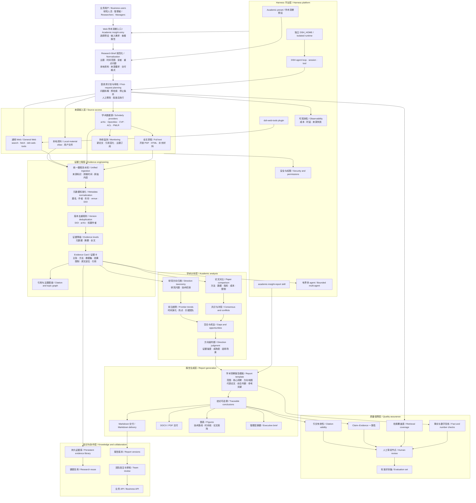

# 学术洞察架构与交付计划

[English](academic-insight-plan.md) | 中文

## 摘要

本页保存学术洞察业务的非权威工作架构与交付计划。团队可以用它拆分工作、约定验收信号并汇报里程碑进展；当前产品行为仍以[学术洞察预设](academic-insight.zh.md)为准。

## 目录

- [工作计划](#working-plan)

-----

### 开发备注：工作计划

本节属于计划材料，不构成产品承诺。团队改变交付决策时，需同步更新状态、里程碑、风险和任务分配。

#### 架构图

架构图展示目标范围，不表示各节点已完成验收；进度以本页里程碑表为准。

#### 当前判断

- 截至 2026-09-21，按当前本地代码及已记录验收汇报：M0 已具备，M1 新入口待验收，M2 收尾与 M3 建设交叉进行，M4 尚未整体启动。实现、自动化验证、真实运行和正式交付分别记录，不互相替代。
- 中文计划审核与按批准计划检索已在本地实现，相关测试通过且 Web 已重启；新流程尚未完成真实端到端验收，修改尚未提交或推送。见[计划检索接入记录](../z-team_docs/开发记录/2026-09-21-zhouzhixian2021-计划到检索接入.md)。
- 真实 RAG 验收保留 4 篇论文、20 条有效证据，生成含 23 个分析段落的有限草稿；论文数与篇幅未达 Plan 要求，语义审核未完成，正式交付仍被阻止。见[洞察分析与验收记录](../z-team_docs/开发记录/2026-09-20-zhouzhixian2021-Academic逐题洞察分析.md)。
- 当前由 A 暂代 B、C 执行开发与验收，B、C 暂停工作；原模块所有权保留，具体边界见[模块分工](../z-team_docs/模块分工/academic-module-ownership.md)。持久化恢复和有界多 agent 仍是未完成能力。

#### 交付里程碑

| 里程碑 | 原定结果与范围 | 当前进度 | 下一验收信号与缺口 | 依赖 |
|---|---|---|---|---|
| M0 — 可运行 MVP | 学术预设、Web 入口、隔离运行数据、通用资料访问及带来源的 Markdown 报告。 | 已具备；真实 Web 能展示和下载研究草稿。 | 保留启动与报告查看回归；不据此宣称研究充分。 | 无。 |
| M1 — 稳定研究输入 | 普通需求形成明确 Research Brief，人工审核后按计划执行；意图等价的请求形成一致规格。 | 中文计划与折叠执行信息、批准计划内检索方案已实现；新入口自动化检查通过，真实验收待完成。 | 用宽泛中文问题生成、审核并执行计划，核对检索与批准内容一致；还需验证简短和详细请求的意图一致性。 | M0。 |
| M2 — 证据流水线 | 学术来源、元数据与版本去重、HTML/PDF 解析、证据卡、来源及原文定位。 | 主流程真实跑通；部分有效证据保留、候选池内补选已实现。 | 改善相关性、版本与范围误排、抽取定位和截断；完整证据持久化恢复、长文分段与自适应追加检索尚未完成。 | M1。 |
| M3 — 可供决策的报告 | 跨论文对比、趋势/冲突/空白分析、引文与主张核验、图表、管理层摘要及 DOCX/PDF。 | 已实现逐题洞察和带缺口说明的有限 Markdown 草稿，已有真实验收；里程碑未完成。 | 基准课题仍需通过覆盖度、数字与语义复核、人工审核；图表及 DOCX/PDF 等目标交付尚未完成。 | M2。 |
| M4 — 可复用研究平台 | 证据库、监测、报告版本、团队审核、业务 API 和有界多 agent。 | 尚未整体启动；现有 Remote 研究入口不等于研究资产复用平台。 | 可恢复、可复用的证据和报告，以及新增资料识别、审核历史与获批结果交付。 | M3。 |

当前顺序：先验收 M1 的计划检索入口，再改善 M2 的选文与证据质量，随后按批准预算设计证据缺口补充检索，推进 M3 语义核验。依据阶段耗时再安排性能优化；持久化恢复需单独确定格式与恢复条件。只有重复业务需求足以支撑共享持久存储和运维责任时，才启动 M4。

#### 团队工作流

| 工作流 | 主要责任 | 主要交付 |
|---|---|---|
| 产品与研究方法 | 定义 Research Brief 字段、报告问题、证据要求和审批标准。 | 版本化研究规格与基准主题。 |
| 检索与提供方 | 实现学术来源连接器、访问策略、重试和来源记录。 | 带稳定标识符的规范化来源文档。 |
| 证据与分析 | 负责去重、Evidence Card、对比、趋势、冲突、空白和置信度规则。 | 与已检查证据关联的可审计主张。 |
| Web 与报告体验 | 展示研究输入、进度、证据、报告导航、导出和审核状态。 | 用户可见工作流与交付产物。 |
| 质量与评测 | 维护基准主题、无效来源用例、引文检查、覆盖度指标和人工审核量表。 | 发布证据与回归信号。 |
| 平台与运维 | 负责运行时隔离、权限、可观测性、成本控制、持久化和后续有界并发。 | 资源使用可问责的可运维部署。 |

#### 进展汇报

每次团队更新记录四项内容：里程碑状态、已完成的验收信号、下一个验收信号，以及需要明确责任人的风险或决策。面向领导的汇报沿用相同结构，并汇总能力价值而不是文件级活动。

架构图同时作为范围边界。只有责任人、依赖、验收信号和所需证据都明确时，拟议能力才能进入里程碑。
