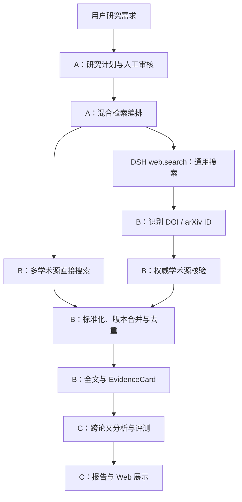

# 学术洞察混合检索团队分工

## 状态与目标

本文记录“通用 Web 搜索 + 多个学术源”的第一版团队实施计划，当前状态为待开发，不代表产品已经支持混合检索。A、B、C 沿用[学术洞察模块分工](academic-module-ownership.md)中的目录所有权；如果 B、C 尚未恢复开发，由 A 暂代执行时仍按本文的模块边界拆分提交，避免把来源、工作流和界面逻辑写入同一目录。

第一版目标是在现有“已批准计划 → 多学术源检索 → 去重选文 → 全文 → EvidenceCard → 跨论文分析 → 报告”主链上增加受控的 Web 发现支路。通用搜索只发现论文候选；只有通过权威学术来源核验的候选才能进入论文、证据和报告主链。



## 固定产品规则

1. 通用搜索结果是待核验线索，不是学术证据。
2. Web Provider 返回的摘要、答案和网页片段不能直接进入 `EvidenceRecord`、`EvidenceCard` 或 Claim。
3. 第一版只核验 DOI 与 arXiv ID；无法识别或无法核验的网页保留统计与限制说明，但不计入论文数量。
4. 学术源直接结果和 Web 核验结果统一进入现有 ingestion，由 DOI、arXiv ID 和 Provider Record ID 等正式标识符合并；URL 不能作为论文唯一身份。
5. 检索渠道、学术 Provider 和数量上限必须进入计划并由用户批准；Agent 不修改全局 `cordis.patch.yml` 来满足单次请求。
6. 单个来源失败不丢弃其他来源结果；用户取消终止整轮，来源失败和取消不能互相伪装。
7. 现有 DSH `ctx.web.search()` 与 `ctx.web.fetch()` 继续拥有通用搜索和安全抓取能力；Academic 业务不得在 DSH 通用包中加入专用条件分支。

## 负责人 A：共享接口、计划与编排

A 负责确定跨模块类型和调用顺序，不实现具体学术网站解析。

### A-H1：冻结第一版接口

A 先确定并合并 B、C 开发所需的最小字段：

- 检索渠道：`academic`、`web_discovery`。
- 计划级学术 Provider 允许列表及 Web 发现数量上限。
- Web 候选状态：已发现、已识别引用、已核验、核验失败、非论文丢弃、重复合并。
- 运行统计：学术源直接发现数、Web URL 数、识别引用数、核验成功数、核验失败数和重复数。
- B 的引用核验输入输出，以及 C 消费的 JSON 安全 Remote 字段。

A 同时提供固定输入输出夹具，使 B、C 不必等待真实网络即可开发。共享字段完成合并前，B、C 不自行创建同义类型。

### A-H2：扩展计划审核

A 将每条批准查询的用途、关联问题和检索策略绑定在一起。计划至少表达启用的渠道、允许的学术 Provider 和 Web 发现上限；用户修改这些字段后必须重新批准。计划解析器拒绝未知渠道、空 Provider、重复 Provider、负数或超出产品上限的数量。

### A-H3：执行双通道检索

A 在 `academic-workflow` 中为每条已批准查询调度学术搜索与 Web 搜索。两个通道可并行执行，结果按批准的查询顺序结算。A 将 Web 结果交给 B 的引用识别与核验接口，只把核验成功的论文交给现有 ingestion。

第一版仍只执行计划中明确批准的查询，不根据搜索结果自动追加查询，不递归追踪引用网络，也不放宽候选、纳入和时间上限。

### A-H4：运行记录与失败结算

A 扩展 `RetrievalRun` 或对应的浏览器安全投影，记录实际执行的渠道、Provider、查询、候选数、核验数、去重数、失败和覆盖限制。学术搜索失败、Web 搜索失败、引用核验失败、全文失败和证据抽取失败保持不同操作类别。

所有进入模型的计划、论文正文和证据继续满足 DSH 的会话记录要求。Web 搜索摘要不进入模型，因此不作为证据输入记录；如果后续产品允许模型读取网页背景材料，必须先增加相应 Session 事件和独立证据类型。

### A-H5：Controller、配置和最终集成

A 在 Academic Controller 中提供 `academicSource.searchAll()`、`web.search()`、引用核验、`web.fetch()`、取消信号和运行时限适配。A 统一修改 Web Bundle、根配置、锁文件、tsconfig、正式架构文档和团队索引，避免 B、C 同时修改高冲突文件。

A 的主要目录：

```text
packages/academic/model/
packages/academic/workflow/
packages/api/academic-research-controller/
packages/preset/agent-presets/presets/academic/
packages/bundle/web-app/cordis.patch.yml
docs/academic-insight*
z-team_docs/
```

## 负责人 B：引用识别、学术核验与证据

B 负责把 Web 搜索线索转换成可以进入现有学术主链的可信论文记录。

### B-H1：识别 Web 论文引用

第一版从 Web URL、标题和明确的标识字段中提取 DOI 与 arXiv ID，并保留原始发现 URL。解析器规范化 DOI 大小写、`doi.org` 前缀、arXiv `/abs/` 与 `/pdf/` 地址；非法或含糊值返回明确失败，不猜测缺失字符。

第二版候选包括 OpenAlex、Semantic Scholar、PubMed/PMC、ACL、CVF、PMLR 和出版商论文页面，第一版不得提前加入无法验收的宽松启发式规则。

### B-H2：按标识符精确核验

B 为 Academic Source 增加由标识符定位论文的明确操作，至少支持：

- arXiv ID 交给 arXiv Provider 获取正式元数据、版本和全文候选。
- DOI 交给 OpenAlex 或后续权威 DOI Resolver 获取正式元数据、来源记录和全文候选。

核验结果使用现有 `AcademicWork` 与 `WorkVersion`。B 不采用 Web 搜索返回的作者、年份、摘要和版本状态填充正式字段，除非对应学术 Provider 已验证这些值。

### B-H3：标准化、合并与溯源

B 保证同一论文通过学术源直接搜索和 Web 间接发现时只保留一个成果身份。正式 DOI、arXiv ID 和 Provider Record ID 优先于标题匹配；标题和作者的模糊相似度只产生审计候选，不自动强制合并。

归并结果保留“Web 发现 URL”和“权威核验 Provider”的来源轨迹。预印本与正式发表版本继续遵守现有 Work/WorkVersion 规则，不能为了去重覆盖版本差异。

### B-H4：失败与证据保护

B 分别返回引用格式错误、未识别网页、学术源无记录、元数据解析失败、限流、超时、网络错误和无全文候选。失败进入来源批次或核验统计，不转成无说明的空数组。

B 保证未核验网页、Web 摘要和 Provider 生成答案不能进入 EvidenceCard。只有现有证据模块接受的正式全文和定位片段才能生成证据。

B 的主要目录：

```text
packages/academic/source/
packages/academic/source-arxiv/
packages/academic/source-openalex/
packages/academic/ingestion/
packages/academic/evidence/
```

B 不直接修改 `academic-workflow`、Academic Controller、专用 Web 页面或 Web Bundle；需要共享字段时向 A 提交接口需求。

## 负责人 C：分析、报告、评测与产品界面

C 负责让用户看见混合检索实际做了什么，并阻止未核验内容进入可交付结论。

### C-H1：计划审核展示

C 在计划预览中显示每条查询的检索渠道、允许的学术 Provider、Web 发现上限和关联研究问题。界面说明 Web 搜索只发现候选，候选必须通过学术来源核验后才能进入报告。

### C-H2：运行进度与统计

C 分开显示学术源搜索、Web 候选发现、学术身份核验、论文去重、全文获取、证据抽取、跨论文分析和报告生成。页面直接消费 A 提供的阶段状态和统计，不从论文数组反推某个阶段是否成功。

终态至少展示学术源直接发现数、Web URL 数、识别引用数、核验成功数、丢弃数、重复数、全文数、有效证据论文数和各来源失败。

### C-H3：报告与评测保护

C 在报告方法和限制部分披露使用的检索渠道、学术 Provider、Web 候选核验情况、来源失败、截断和数量上限。第一版普通网页不进入学术参考文献。

`academic-eval` 检查 Claim 只引用核验后的论文证据，未核验 Web 候选不计入论文覆盖，报告不得在来源失败或截断时宣称完整覆盖。

### C-H4：浏览器验收

C 使用 A 的固定 Remote 夹具完成无网络页面测试，再使用真实服务录制计划审核、混合检索状态和报告限制的 GUI GIF。用户可见 PR 遵守仓库的 GIF 证据要求。

C 的主要目录：

```text
packages/academic/analysis/
packages/academic/report/
packages/academic/eval/
packages/client/ui-academic-research/
```

C 不修改 Academic Source Provider 或 ingestion；缺少展示字段时向 A 提交接口需求，缺少证据字段时向 B 提交需求。

## 并行条件与合并顺序

### 第一阶段：A 先合并接口基线

A-H1 先进入 `master`。该 PR 只冻结共享类型、Remote 字段、B 的核验接口和 C 的固定夹具，不要求真实网络功能完成。B、C 从包含该接口的最新 `master` 创建或更新个人分支。

### 第二阶段：三人并行

| 成员 | 并行交付 | 不修改的高冲突范围 |
|---|---|---|
| A | A-H2 至 A-H4：计划、工作流、Controller 和运行记录 | B 的 Provider 实现；C 的页面和报告 |
| B | B-H1 至 B-H4：引用提取、精确核验、归并和证据保护 | 工作流、Controller、页面、根配置 |
| C | C-H1 至 C-H4：计划预览、进度、报告、评测和 GUI 验收 | Provider、ingestion、工作流、根配置 |

### 第三阶段：集成顺序

1. 合并 A-H1 共享接口基线。
2. 合并 B 的引用识别与权威核验。
3. A 拉取最新 `master`，完成并合并双通道工作流与 Controller。
4. C 拉取包含正式 Remote 字段的 `master`，完成最终界面、报告和评测合并。
5. A 统一完成 Bundle 配置、锁文件、真实端到端验收、正式文档和团队记录。

每个成员的开发记录使用独立文件；只有 A 修改正式总体计划和团队索引。独立 PR 不夹带其他成员目录的格式化或顺手重构。

## 第一版验收标准

使用一条固定研究需求同时启用 OpenAlex、arXiv 和 DSH 通用 Web 搜索，并限制候选和最终纳入论文数。第一版只有在以下事实全部成立时完成：

1. 同一条已批准查询实际执行学术搜索和 Web 搜索。
2. Web 搜索能够发现至少一个 DOI 或 arXiv URL，并保留发现来源。
3. DOI 或 arXiv ID 经过对应权威学术 Provider 核验后才进入 ingestion。
4. 同一论文被两个渠道发现时只保留一个成果身份，版本关系不被覆盖。
5. 普通博客、新闻和无法核验的网页不进入 EvidenceCard、Claim 或参考文献。
6. 单个学术 Provider 失败时保留其他学术源和 Web 核验结果；Web 搜索失败时保留学术搜索结果。
7. 页面分别显示直接发现、Web 发现、识别、核验、去重、全文和证据数量。
8. 报告披露混合检索渠道、失败、截断、核验丢弃和覆盖限制。
9. 报告中的学术结论仍能追溯到论文原文与 SourceLocator。
10. 计划、渠道选择和模型可见输入能够从 Session 记录重建。
11. 自动化测试覆盖成功、部分成功、全部核验失败、重复候选、取消和非法计划字段。
12. GUI 改动使用真实 PR 服务流程录制并附加演示 GIF。

## 第一版不包含的能力

- 任意网站自动生成或安装 Academic Provider。
- 将普通网页作为论文证据或学术参考文献。
- 根据运行结果自动追加未经批准的查询。
- 引用网络递归搜索和无限深度研究。
- Semantic Scholar、PubMed 和所有出版商的一次性完整接入。
- 自适应饱和判断、跨运行索引恢复和完整工作流断点续跑。

这些能力在第一版真实数据、失败率和成本可测量后分别立项，不扩大本轮共享接口。
