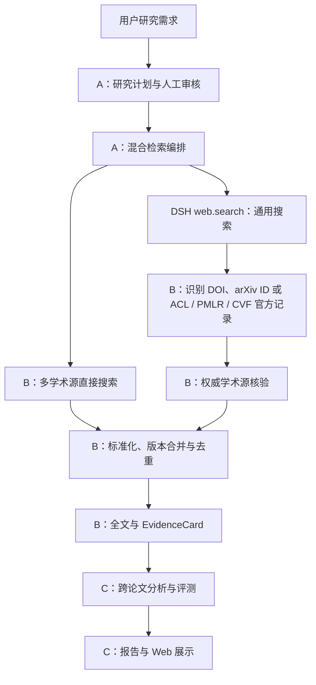

# 学术洞察混合检索团队分工

## 状态与目标

本文记录“通用 Web 搜索 + 多个学术源”的第一版团队实施计划。A-H1、A-H2、A-H3a 与 B-H1、B-H2（含按计划指定 Provider 搜索）已合并。A-H3b 与 A-H4 已在个人分支接入 Controller 和运行统计，完成定向无密钥回归，待提交；B-H3/B-H4、C 展示与真实网络验收仍需推进。A、B、C 沿用[学术洞察模块分工](academic-module-ownership.md)中的目录所有权；临时代办也按本文的模块边界拆分提交，避免把来源、工作流和界面逻辑写入同一目录。

第一版目标是在现有“已批准计划 → 多学术源检索 → 去重选文 → 全文 → EvidenceCard → 跨论文分析 → 报告”主链上增加受控的 Web 发现支路。通用搜索只发现论文候选；只有通过权威学术来源核验的候选才能进入论文、证据和报告主链。



## 固定产品规则

1. 通用搜索结果是待核验线索，不是学术证据。
2. Web Provider 返回的摘要、答案和网页片段不能直接进入 `EvidenceRecord`、`EvidenceCard` 或 Claim。
3. 第一版核验 DOI、arXiv ID，以及 ACL Anthology、PMLR、CVF 的官方论文记录。识别成功不等于核验通过；无法识别或无法核验的网页保留统计与限制说明，但不计入论文数量。
4. 学术源直接结果和 Web 核验结果统一进入现有 ingestion，由 DOI、arXiv ID 和带来源命名空间的 Provider Record ID 等已核验标识符合并。普通发现 URL 不作为成果身份；经核验的官方规范 URL 可作为对应 Provider 的记录标识，不能据此自动合并其他来源的记录。
5. 检索渠道、学术 Provider 和数量上限必须进入计划并由用户批准；Agent 不修改全局 `cordis.patch.yml` 来满足单次请求。
6. 单个来源失败不丢弃其他来源结果；用户取消终止整轮，来源失败和取消不能互相伪装。
7. 现有 DSH `ctx.web.search()` 与 `ctx.web.fetch()` 继续拥有通用搜索和安全抓取能力；Academic 业务不得在 DSH 通用包中加入专用条件分支。

## 负责人 A：共享接口、计划与编排

A 负责确定跨模块类型和调用顺序，不实现具体学术网站解析。

### A-H1：冻结第一版接口

A 先确定并合并 B、C 开发所需的最小字段：

- 检索渠道：`academic`、`web_discovery`。
- 计划级学术 Provider 允许列表、Web 发现数量上限及引用核验数量上限；区分直接检索 Provider 与引用核验 Provider，允许仅核验 ACL/PMLR/CVF 而不扫描其目录。
- 引用输入覆盖 DOI、arXiv ID，以及 ACL/PMLR/CVF 的 `provider_record`。来源专用记录携带 Provider、规范化记录标识与原始发现 URL；复用现有模型，不另建平行的论文身份体系。
- Web 候选状态：已发现、已识别引用、已核验、核验失败、非论文丢弃、重复合并。
- 运行统计：学术源直接发现数、Web URL 数、识别引用数、核验成功数、核验失败数和重复数。
- B 的引用核验输入输出，以及 C 消费的 JSON 安全 Remote 字段。

A 同时提供五类引用的固定输入输出夹具，包含没有 DOI/arXiv ID 的官方记录，使 B、C 不必等待真实网络即可开发。共享字段完成合并前，B、C 不自行创建同义类型。

### A-H2：扩展计划审核

**当前进度：已合并。** 第 3 版计划要求每条查询携带检索策略；第 1、2 版继续兼容。A-H3b 将第 3 版获批策略接入运行；修改策略仍须重新审核。

A 将每条批准查询的用途、关联问题和检索策略绑定在一起。计划至少表达启用的渠道、允许直接检索和引用核验的学术 Provider、Web 发现上限及引用核验上限；用户修改这些字段后必须重新批准。计划解析器拒绝未知渠道、不支持的 Provider、空 Provider、重复 Provider、负数或超出产品上限的数量。用户审核来源范围和预算，无需填写编号、枚举或 JSON。

### A-H3：执行双通道检索

**当前进度：A-H3a 已合并；A-H3b 已在个人分支完成，待提交。** Controller 已按获批查询接入真实 `searchProviders()`、DSH `web.search()`、引用识别与 `verifyReference()`，第 3 版计划可以运行；旧计划保留原路径。无密钥回归验证了预算、来源选择、单侧失败保留、取消及核验论文进入报告流水线。A-H4 详细混合投影已接入；真实网络端到端验收尚未完成。

A 在 `academic-workflow` 中为每条已批准查询调度学术搜索与 Web 搜索。两个通道可并行执行，结果按批准的查询顺序结算。A 将 Web 结果交给 B 的引用识别与核验接口，只把核验成功的论文交给现有 ingestion。

核验只调用计划允许的对应 Provider，消耗独立的引用核验预算并受整轮时间上限与取消信号约束。仅启用核验的 Provider 不计作实际执行过直接检索；同一官方记录的重复链接先规范化去重，避免重复核验。增加支持的引用类型不自动增加查询、候选、纳入或并发上限。

第一版仍只执行计划中明确批准的查询，不根据搜索结果自动追加查询，不递归追踪引用网络，也不放宽候选、纳入和时间上限。

### A-H4：运行记录与失败结算

**当前进度：个人分支已完成，待提交。** 固定 `hybridRetrieval` 字段已由真实执行结果产生；候选与引用新增可选 `query` 供 C 关联实际查询。记录渠道状态、URL／引用／核验／论文计数、识别与核验原因和精确合并情况；核验专用来源不计作直接检索来源。多查询统计保留已完成部分，中断查询在运行限制中说明；预算截断不计作去重或来源失败。尚未验收 C 页面和真实网络。

A 扩展 `RetrievalRun` 或对应的浏览器安全投影，记录实际执行的渠道、Provider、查询、候选数、核验数、去重数、失败和覆盖限制，并区分引用类型及实际核验 Provider。一个网页可发现多个引用，多个引用也可能对应同一论文；Web URL 数、核验引用数与去重论文数不可混用。学术搜索失败、Web 搜索失败、引用核验失败、全文失败和证据抽取失败保持不同操作类别。

所有进入模型的计划、论文正文和证据继续满足 DSH 的会话记录要求。Web 搜索摘要不进入模型，因此不作为证据输入记录；如果后续产品允许模型读取网页背景材料，必须先增加相应 Session 事件和独立证据类型。

### A-H5：Controller、配置和最终集成

A 在 Academic Controller 中提供 `academicSource.searchAll()`、`web.search()`、引用核验、`web.fetch()`、取消信号和运行时限适配。A 统一修改 Web Bundle、根配置、锁文件、tsconfig、正式架构文档和团队索引，避免 B、C 同时修改高冲突文件。

A 的主要目录：

```text
packages/academic/model/
packages/academic/workflow/
packages/api/academic-research-controller/
packages/preset/agent-presets/presets/academic/
packages/bundle/web-app/cordis.patch.yml
docs/academic-insight*
z-team_docs/
```

## 负责人 B：引用识别、学术核验与证据

B 负责把 Web 搜索线索转换成可以进入现有学术主链的可信论文记录。

### B-H1：识别 Web 论文引用

第一版识别以下五类引用，并保留原始发现 URL：

| 引用 | 识别入口与规范化要求 | 核验归属 |
|---|---|---|
| DOI | URL、标题或明确标识字段中的完整 DOI；规范化大小写与 `doi.org` 前缀 | OpenAlex 或后续 DOI Resolver |
| arXiv ID | 明确编号、官方 `/abs/` 或 `/pdf/` 地址；保留显式版本后缀 | arXiv |
| ACL Anthology 记录 | 官方论文页或 PDF 中的 ACL 编号；记录标识带 `acl` 来源 | ACL |
| PMLR 记录 | 官方论文页或 PDF 中的卷号与论文路径；记录标识带 `pmlr` 来源 | PMLR |
| CVF 记录 | 官方论文详情页或可准确还原详情页的 PDF 地址；保留规范化详情页 URL，记录标识带 `cvf` 来源 | CVF |

来源专用引用必须检查官方主机名和受支持的论文路径结构，不根据相似域名、任意链接或标题猜测。识别结果分别携带成功引用与识别问题；同一候选中的成功引用不因其他问题被丢弃，没有成功引用时至少返回一条 `unrecognized_page`、`invalid_reference` 或 `ambiguous_reference` 问题。识别器不猜测缺失字符；任意 BibTeX Key 不作为全局唯一标识。官方目录页、搜索页与论文页必须区分。

后续候选包括 OpenAlex 原生记录入口、Semantic Scholar、PubMed/PMC、NeurIPS Proceedings、OpenReview 和其他出版商页面的专用核验。第一版允许从这些网页识别明确的 DOI/arXiv ID，但不据此声称支持其专用记录核验。

### B-H2：按标识符精确核验

B 为 Academic Source 增加由标识符定位论文的明确操作，至少支持：

- arXiv ID 交给 arXiv Provider 获取正式元数据、版本和全文候选。
- DOI 交给 OpenAlex 或后续权威 DOI Resolver 获取正式元数据、来源记录和全文候选。
- ACL 编号、PMLR 卷号与论文路径、CVF 官方规范页面分别交给对应 Provider，读取官方论文元数据并核对请求的记录标识，返回版本与全文候选。

现有 ACL/PMLR/CVF 的目录搜索与 `fullTextUrls()` 可复用，但尚不等于任意 Web 入口的精确核验。B 必须补齐按记录定位及元数据核验；不能仅凭 URL 格式合法、拼出 PDF 地址或 HTTP 成功就认定论文已核验。核验仅访问该论文所需的官方记录，不顺带扫描其他目录或扩展引用网络。没有 DOI/arXiv ID 的官方记录也应能在核验后返回 `provider_record`。

核验结果使用现有 `AcademicWork` 与 `WorkVersion`。B 不采用 Web 搜索返回的作者、年份、摘要和版本状态填充正式字段，除非对应学术 Provider 已验证这些值。

### B-H3：标准化、合并与溯源

B 对共享已核验 DOI、arXiv ID、同来源 Provider Record ID 或已核验对应关系的记录进行归并，避免同一论文通过直接搜索和 Web 间接发现后重复处理。来源内部编号必须带 Provider 命名空间；不同来源的编号不能直接互比。缺少上述依据时，标题和作者的模糊相似度只产生审计候选，不自动强制合并，也不宣称已经完成跨来源去重。

归并结果保留“Web 发现 URL”和“权威核验 Provider”的来源轨迹。预印本与正式发表版本继续遵守现有 Work/WorkVersion 规则，不能为了去重覆盖版本差异。

### B-H4：失败与证据保护

B 分别返回引用格式错误、未识别网页、学术源无记录、元数据解析失败、限流、超时、网络错误和无全文候选。失败进入来源批次或核验统计，不转成无说明的空数组。

B 保证未核验网页、Web 摘要和 Provider 生成答案不能进入 EvidenceCard。只有现有证据模块接受的正式全文和定位片段才能生成证据。

B 的主要目录：

```text
packages/academic/source/
packages/academic/source-arxiv/
packages/academic/source-openalex/
packages/academic/source-acl/
packages/academic/source-pmlr/
packages/academic/source-cvf/
packages/academic/ingestion/
packages/academic/evidence/
```

B 不直接修改 `academic-workflow`、Academic Controller、专用 Web 页面或 Web Bundle；需要共享字段时向 A 提交接口需求。

## 负责人 C：分析、报告、评测与产品界面

C 负责让用户看见混合检索实际做了什么，并阻止未核验内容进入可交付结论。

### C-H1：计划审核展示

C 在计划预览中显示每条查询的检索渠道、允许直接检索与引用核验的学术 Provider、Web 发现和引用核验上限及关联研究问题。界面说明 Web 搜索只发现候选，候选必须通过学术来源核验后才能进入报告；不要求用户填写 DOI、arXiv ID 或来源内部编号。

### C-H2：运行进度与统计

C 分开显示学术源搜索、Web 候选发现、学术身份核验、论文去重、全文获取、证据抽取、跨论文分析和报告生成。页面直接消费 A 提供的阶段状态和统计，不从论文数组反推某个阶段是否成功。

终态至少展示学术源直接发现数、Web URL 数、识别引用数、核验成功数、丢弃数、重复数、全文数、有效证据论文数和各来源失败，并能区分五类引用及对应核验来源。仅识别出官方链接不显示为“论文核验成功”；因类型不支持而丢弃与已发起核验但失败应分别说明。

### C-H3：报告与评测保护

C 在报告方法和限制部分披露使用的检索渠道、学术 Provider、Web 候选核验情况、来源失败、截断和数量上限。第一版普通网页不进入学术参考文献。

`academic-eval` 检查 Claim 只引用核验后的论文证据，未核验 Web 候选不计入论文覆盖，报告不得在来源失败或截断时宣称完整覆盖。

### C-H4：浏览器验收

C 使用 A 的固定 Remote 夹具完成无网络页面测试，再使用真实服务录制计划审核、混合检索状态和报告限制的 GUI GIF。用户可见 PR 遵守仓库的 GIF 证据要求。

C 的主要目录：

```text
packages/academic/analysis/
packages/academic/report/
packages/academic/eval/
packages/client/ui-academic-research/
```

C 不修改 Academic Source Provider 或 ingestion；缺少展示字段时向 A 提交接口需求，缺少证据字段时向 B 提交需求。

## 并行条件与合并顺序

### 第一阶段：A 先合并接口基线

A-H1 先进入 `master`。该 PR 只冻结共享类型、Remote 字段、B 的核验接口和 C 的固定夹具，不要求真实网络功能完成。B、C 从包含该接口的最新 `master` 创建或更新个人分支。

### 第二阶段：三人并行

| 成员 | 并行交付 | 不修改的高冲突范围 |
|---|---|---|
| A | A-H2 至 A-H4：计划、工作流、Controller 和运行记录 | B 的 Provider 实现；C 的页面和报告 |
| B | B-H1 至 B-H4：引用提取、精确核验、归并和证据保护 | 工作流、Controller、页面、根配置 |
| C | C-H1 至 C-H4：计划预览、进度、报告、评测和 GUI 验收 | Provider、ingestion、工作流、根配置 |

### 第三阶段：集成顺序

1. 合并 A-H1 共享接口基线。
2. 合并 B 的引用识别与权威核验。
3. A 拉取最新 `master`，完成并合并双通道工作流与 Controller。
4. C 拉取包含正式 Remote 字段的 `master`，完成最终界面、报告和评测合并。
5. A 统一完成 Bundle 配置、锁文件、真实端到端验收、正式文档和团队记录。

每个成员的开发记录使用独立文件；只有 A 修改正式总体计划和团队索引。独立 PR 不夹带其他成员目录的格式化或顺手重构。

## 第一版验收标准

使用一条固定研究需求同时启用 OpenAlex、arXiv 直接检索和 DSH 通用 Web 搜索，允许五类引用的对应 Provider 核验，并限制发现、核验、候选和最终纳入数量。固定自动化夹具覆盖全部五类引用，真实发现验收不要求一次搜索恰好返回全部五类；另用固定官方记录分别验收 ACL/PMLR/CVF 的真实精确核验。第一版只有在以下事实全部成立时完成：

1. 同一条已批准查询实际执行学术搜索和 Web 搜索。
2. Web 搜索能够发现至少一个受支持的论文引用，并保留发现来源；固定夹具和官方记录验收包含没有 DOI/arXiv ID 的 ACL、PMLR、CVF 记录。
3. 五类引用均经过对应学术 Provider 核验后才进入 ingestion；伪造主机名、非法或不存在的记录、仅可拼接的 PDF 地址不能被误报为核验成功。
4. 同一论文被两个渠道发现且共享已核验标识时只保留一个成果身份，版本关系不被覆盖；仅标题相似的跨来源记录不强制合并。
5. 普通博客、新闻和无法核验的网页不进入 EvidenceCard、Claim 或参考文献。
6. 单个学术 Provider 失败时保留其他学术源和 Web 核验结果；Web 搜索失败时保留学术搜索结果。
7. 页面分别显示直接发现、Web 发现、识别、核验、去重、全文和证据数量。
8. 报告披露混合检索渠道、失败、截断、核验丢弃和覆盖限制。
9. 报告中的学术结论仍能追溯到论文原文与 SourceLocator。
10. 计划、渠道选择和模型可见输入能够从 Session 记录重建。
11. 自动化测试覆盖五类引用的成功、部分成功、全部核验失败、重复链接与候选、来源命名空间隔离、取消、核验预算耗尽和非法计划字段；仅核验的来源不伪计为已直接检索。
12. GUI 改动使用真实 PR 服务流程录制并附加演示 GIF。

## 第一版不包含的能力

- 任意网站自动生成或安装 Academic Provider。
- 将普通网页作为论文证据或学术参考文献。
- 根据运行结果自动追加未经批准的查询。
- 引用网络递归搜索和无限深度研究。
- OpenAlex 原生记录入口、Semantic Scholar、PubMed/PMC、NeurIPS Proceedings、OpenReview 及其他出版商页面的新增专用核验；不影响从这些页面识别已支持的 DOI/arXiv ID。
- 自适应饱和判断、跨运行索引恢复和完整工作流断点续跑。

这些能力在第一版真实数据、失败率和成本可测量后分别立项，不扩大本轮共享接口。
