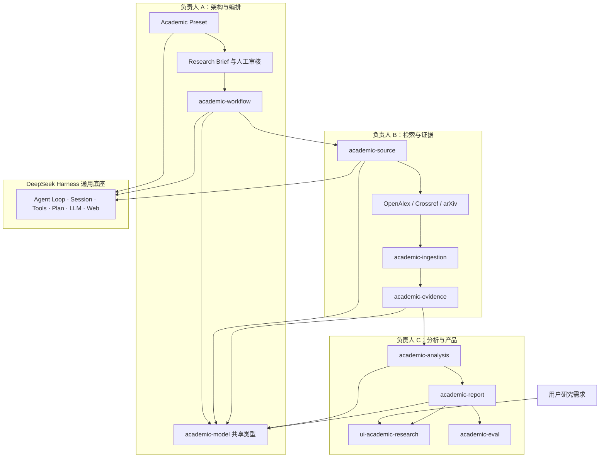

# 学术洞察模块总览

## 状态

本目录保存三人团队的拟议模块边界。负责人姓名尚未全部登记，文档先使用负责人 A、B、C；团队确认成员后，在[成员与分支](../02-成员与分支.md)中建立唯一映射。这里描述计划，不表示对应源码包已经实现。

## 架构原则

Insight Agent 的学术业务依赖 DeepSeek Harness 的插件、会话、工具、模型和 Web 能力；DeepSeek Harness 通用包不得反向依赖 Academic 业务。Academic Preset 只负责组装，检索、证据、分析和报告逻辑分别进入独立包，跨模块数据只通过 `academic-model` 中确认的类型传递。



## 拟议源码目录

以下目录由对应能力的第一个实现 PR 创建。团队不提前提交空目录或占位包。

```text
packages/academic/
├── model/                 # A：共享类型、标识符和版本
├── workflow/              # A：研究阶段编排与恢复
├── source/                # B：学术来源能力接口与消费工具
├── source-openalex/       # B：OpenAlex Provider
├── source-crossref/       # B：Crossref Provider
├── source-arxiv/          # B：arXiv Provider
├── ingestion/             # B：标准化、版本合并与去重
├── evidence/              # B：Evidence Record 与 Evidence Card
├── analysis/              # C：分类、对比、趋势、冲突与空白
├── report/                # C：报告结构、引用和导出
└── eval/                  # C：基准课题、量表与回归样例

packages/client/ui-academic-research/    # C：专用研究界面
packages/preset/agent-presets/presets/academic/  # A：现有组装入口
```

## 负责人边界

| 负责人 | 独占范围 | 主要交付 | 必须邀请的审核人 |
|---|---|---|---|
| A | 共享类型、工作流、Preset、跨包集成、正式架构文档 | 稳定接口、阶段状态、会话恢复、发布组合 | A 作最终决定；B、C 的需求作为设计输入 |
| B | 来源、Provider、摄取、去重、证据记录 | 可追溯且标准化的论文证据 | A 审核接口，C 审核分析所需字段 |
| C | 分析、报告、评测、专用 Web 体验 | 可审核的结论、报告和用户工作流 | A 审核集成，B 审核证据使用 |

## 当前能力归属

现有 Academic Preset、Research Brief、Plan Mode 组装、Academic Skill、独立 `DSH_HOME` 启动入口和正式 Academic 文档由 A 维护。通用 `web_search` 与 `web_fetch` 是临时来源能力，不归 Academic 业务包所有；B 在学术来源能力可用后负责把它们降为补充路径。当前报告方法由 C 接管内容验收，运行时 Skill 的组装位置仍由 A 维护。

## 集成顺序

1. A 根据 B、C 已提交的需求确定共享类型和研究状态接口。
2. B 开发来源到证据的纵向切片，C 使用固定证据夹具并行开发分析、报告和评测。
3. B、C 的模块 PR 合并后，A 单独完成工作流和 Academic Preset 集成。
4. 工作流投影稳定后，C 再接入专用 Web 页面。

## 高冲突文件

| 路径 | 默认修改人 | 规则 |
|---|---|---|
| `packages/academic/model/**` | A | A 统一决策并先合并，B、C随后消费 |
| Academic Preset | A | B、C提交配置需求，不并行修改 |
| `packages/plan/**`、`packages/core/**` | A | 只接受通用能力，不加入 Academic 条件 |
| 根配置、锁文件和 tsconfig | 当前集成人 | 同一时段只允许一个 PR修改 |
| `docs/academic-insight*` | A | 正式产品事实只在原文档维护 |
| `z-team_docs/开发记录/**` | 每项任务负责人 | 每项任务使用独立文件 |

## 文档入口

- [负责人 A：架构与编排](member-a-architecture.md)
- [负责人 B：检索与证据](member-b-evidence.md)
- [负责人 C：分析与产品](member-c-product.md)
- [Academic Model v1 共享数据设计草案](academic-model-v1-design.md)
- [正式学术洞察架构与交付计划](../../docs/academic-insight-plan.zh.md)
- [成员与分支登记](../02-成员与分支.md)

